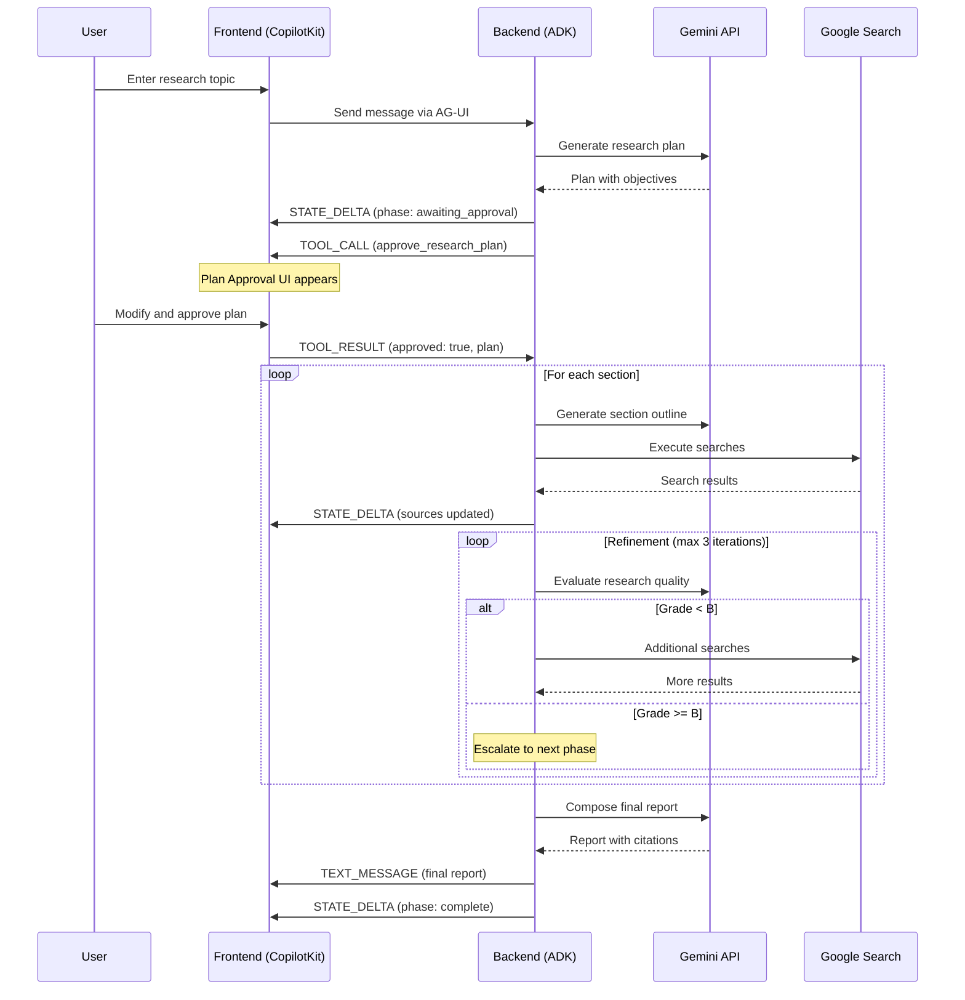
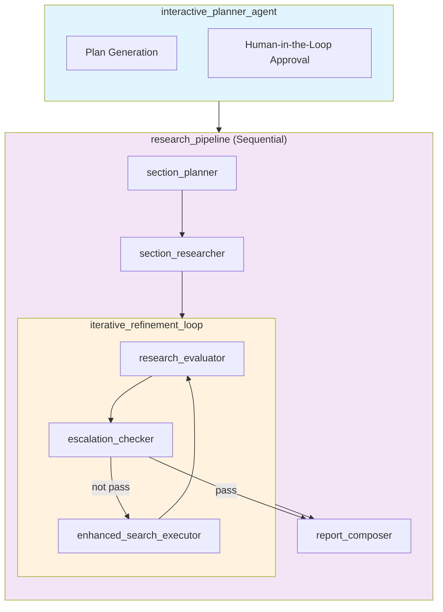
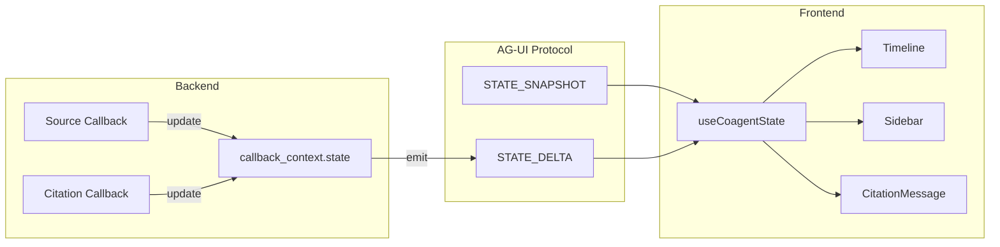
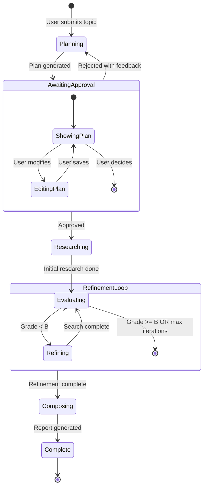
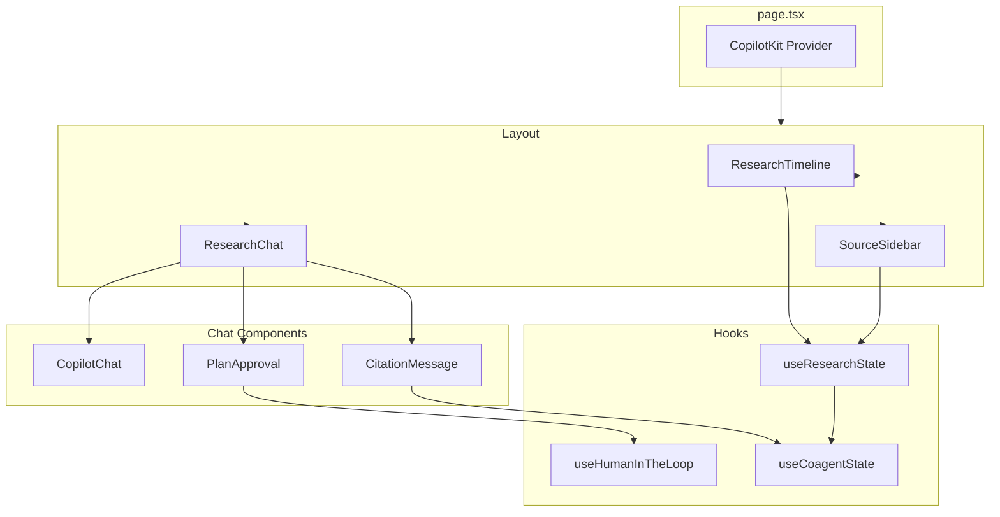
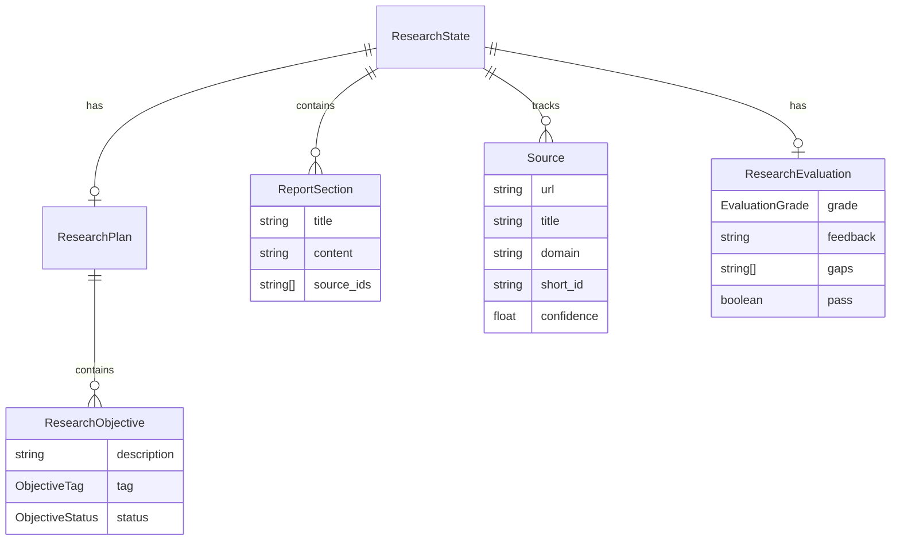

# Deep Search POC - Architecture Diagrams

## 1. User Journey Flow



## 2. Agent Hierarchy



## 3. State Flow



## 4. Human-in-the-Loop Flow



## 5. Component Architecture



## 6. Event Timeline

```mermaid
gantt
    title Research Session Event Timeline
    dateFormat X
    axisFormat %s

    section Lifecycle
    RUN_STARTED           :0, 1
    RUN_FINISHED          :98, 100

    section Planning
    TEXT_MESSAGE (plan)    :1, 10
    TOOL_CALL (approve)    :10, 15
    TOOL_RESULT (approved) :15, 16

    section Research
    STATE_DELTA (phase)    :16, 17
    TOOL_CALL (search)     :17, 25
    STATE_DELTA (sources)  :25, 26
    TEXT_MESSAGE (findings):26, 35

    section Evaluation
    STATE_DELTA (phase)    :35, 36
    TEXT_MESSAGE (eval)    :36, 45

    section Refinement
    TOOL_CALL (search)     :45, 55
    STATE_DELTA (sources)  :55, 56

    section Composition
    STATE_DELTA (phase)    :56, 57
    TEXT_MESSAGE (report)  :57, 95
    STATE_DELTA (complete) :95, 98
```



## 7. Data Models



## 8. Deployment Architecture

```mermaid
graph TB
    subgraph "User Browser"
        UI[Next.js Frontend]
    end

    subgraph "Vercel / Cloud Run"
        FE[Frontend Container]
        API[/api/copilotkit]
    end

    subgraph "Cloud Run / GKE"
        BE[FastAPI Backend]
        ADK[ADK Middleware]
    end

    subgraph "Google Cloud"
        GEM[Gemini API]
        GSE[Google Search]
    end

    UI --> FE
    FE --> API
    API -->|AG-UI SSE| BE
    BE --> ADK
    ADK --> GEM
    ADK --> GSE
```
